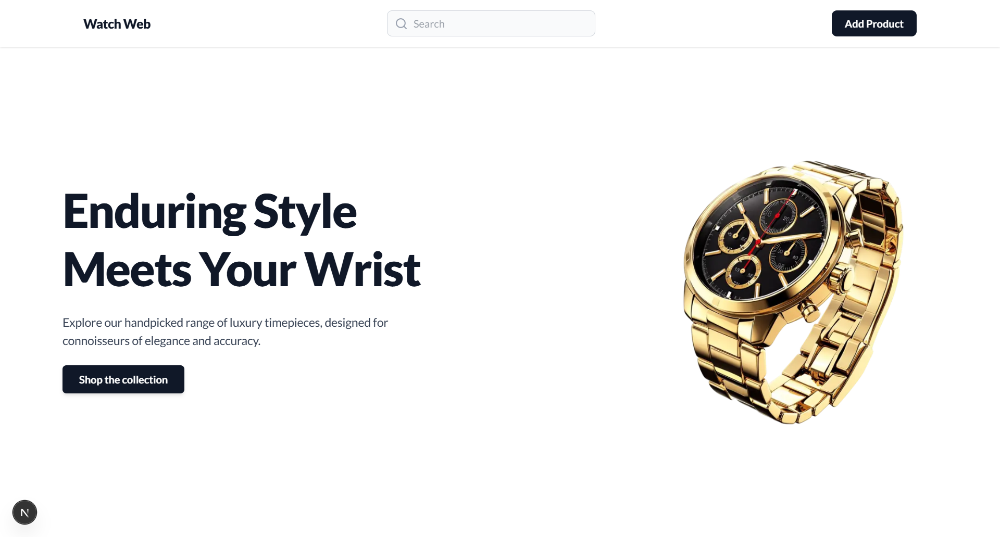

# 🕰️ Watch Web — Premium Watches Marketplace

A modern, full-featured marketplace for buying and selling luxury watches. Built with **Next.js (App Router)**, **MongoDB**, and **Tailwind CSS**, the app focuses on a clean, professional UI, smooth user experience, and easy product management.

---

## 📸 Demo



---

## 🚀 Features

- **Beautiful Home & Product Pages**
  - Head-turning hero section
  - Responsive product grid
  - Detailed product pages with contact action

- **CRUD Operations**
  - Add, update, and delete products with forms and image preview

- **Search Bar**
  - Instant search via the navbar, with a dedicated results page

- **Professional UI**
  - Consistent branding & color scheme
  - Custom scrollbars for aesthetic polish

- **Notifications**
  - Success/error toasts via `react-hot-toast`

- **Mobile Responsive**
  - Fully adaptive layouts and components for all devices

---

## 🛠️ Tech Stack

| Technology    | Purpose                  |
|---------------|--------------------------|
| Next.js 14+   | React Framework + SSR    |
| Tailwind CSS  | Utility-first styling    |
| MongoDB       | Database                 |
| Mongoose      | Database ORM             |
| Cloudinary API| Image upload & hosting   |
| Axios         | API requests             |
| React Hot Toast | User notifications     |
| Lucide-React  | Beautiful SVG icons      |

---

## 📂 Folder Structure

```bash
/app
/api # API routes
/components # React components
/providers # Context providers
/utils # Helper functions
/db # DB connection
/models # Mongoose models
/public # Static assets (incl. images)
globals.css # Tailwind/global styles
layout.tsx # Root layout
```

---

## 📦 Setup & Install

1. **Clone the repo**
```bash
git clone https://github.com/nipun-munasinghe/watch-web.git
cd watch-web
```

2. **Install dependencies**

```bash
npm install
```

3. **Configure environment**

- Copy `.env.example` to `.env.local` and fill in your MongoDB connection string.

4. **Run the development server**

```bash
npm run dev
```

Visit `http://localhost:3000`

---

## ✨ Credits

- Font: [Lato by Google Fonts]
- Images: Vecteezy
- Icons: [Lucide React]

---

## 📤 Contribution

Pull requests are welcome. For major changes, open an issue first to discuss what you would like to change or improve!

## Contact

- Developer: Nipun Munasinghe
- LinkedIn: [Nipun Lakmal](https://www.linkedin.com/in/nipun-lakmal-b5b3652bb?utm_source=share&utm_campaign=share_via&utm_content=profile&utm_medium=ios_app)
- Email: [nipunlakmal884@gmail.com](mailto:nipunlakmal884@gmail.com)
- GitHub: [nipun-munasinghe](https://github.com/nipun-munasinghe)
---

**Enjoy your new, professional watch marketplace!**  
_Remember to star the repo if you found it helpful._  
